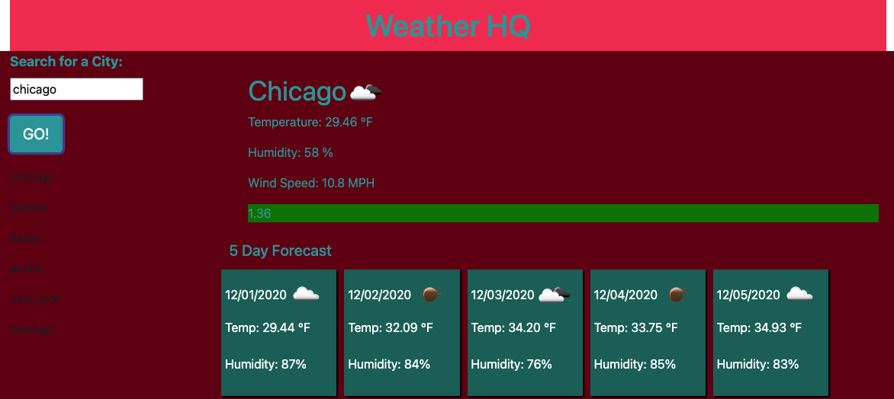

# Weather HQ!

## Table of Contents
* Description
* Active URLS
* Resources
* Screenshot
* Additional Questions 

## Description
When you load the webpage, there will be a form available to enter the value of a city name. Once you press the search button, it the application will fetch weather data from a third party server. There will be an up to date current weather display, as well as a 5 day forecast. Each time you select a new city, the city you were just viewing will be added to the page as a button that you can recall again later. 

This is a homework assignment for the Northwestern University Coding Program. It involves using third party API's to gather data and display that data on a webpage.

## Active URLS
[Github Repository](https://github.com/jkwagneriii/HW-6-Weather)

[GitHub Live Page](https://jkwagneriii.github.io/HW-6-Weather/)

## Resources
[Open Weather API](https://openweathermap.org/api)

## Screenshot

## Additional Questions
If you have any questions about the project or would like to contact me, please reach out through [GitHub](https://github.com/jkwagneriii).

